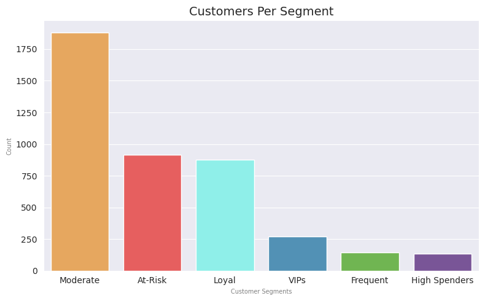
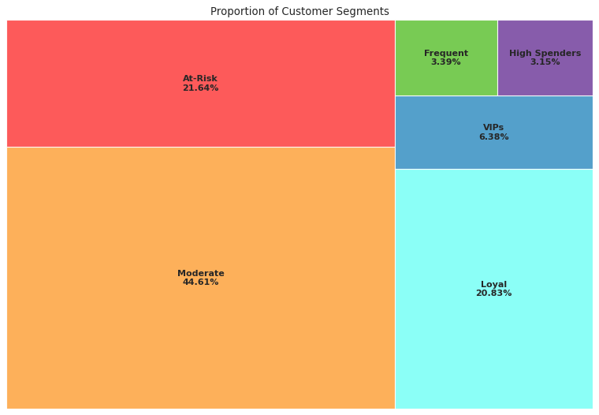

# Customer Segmentation For An Online Retail Store

*Customer Segmentation is a valuable tool for businesses, enabling them to align their strategies and tactics more effectively with current and potential customers. In today's marketing landscape, whether in B2B (business-to-business) or B2C (business-to-consumer) contexts, companies segment their customers based on various factors, including demographic, geographic, behavioral, psychographic, and technographic characteristics.The methodologies for customer segmentation are constantly evolving and may differ from one company to another. However, the primary goal of effective customer segmentation analysis is to gain a better understanding of customers' ever-changing needs and behaviors.*

*RFM (Recency, Frequency, Monetary) Analysis is a powerful method that enables marketing teams to create targeted campaigns for specific customer segments. These campaigns include offers, messages, and services that are relevant and tailored to customers’ buying patterns and behaviors.*

*An effective customer segmentation analysis leads to better customer insights, which enable marketing teams to make informed strategic decisions regarding messaging and positioning. This strategic approach fosters innovative and creative solutions that enhance profitability.* 

## 1. Data

This project utilizes machine learning for customer segmentation based on RFM analysis, focusing on three key features: Recency, Frequency, and Monetary value. The analysis aims to uncover valuable insights into customer purchasing behavior and transform the transactional data into a customer-centric dataset through feature engineering. Using clustering algorithms in Machine Learning will effectively aid in segmenting customers, enabling the business to determine appropriate marketing strategies and enhance the customer experience. Additionally, this analysis has the potential to significantly boost product sales and drive revenue, offering a promising outlook for the future.

Data Source: [UCI Machine Learning Repository | Online Retail II](https://archive.ics.uci.edu/dataset/502/online+retail+ii)

The dataset contains all transactions for a UK-based online retailer that sells all occasion gift-ware. This e-commerce dataset, made available by the UCI Machine Learning Repository, contains transactions made by customers from 2009 to 2011. This project will work on the latest transactions done in 2010 by approximately 4,300 customers.

Detailed description of the fields can be found in the aforementioned link.

## 2. Data Wrangling

The [Data Wrangling](../notebooks/DataWrangling.ipynb) step kicked off with 541,910 records in the 2010 dataset tab. 

Several inconsistencies were identified, including blank customer IDs (approximately 25%), negative quantity values (1.6%), which were related to canceled invoices, and duplicate records (around 1%). These problematic records were removed from the dataset, as they were not particularly useful in analyzing customer transactions. 

One noteworthy column contained invoice values that did not conform to the documented format. However, a thorough investigation revealed that these records had no anomalies in their respective numeric data. These transactions were assumed to be entered manually or processed outside the official order placement system. Since there were no irregularities in the numeric data, these records were included in the analysis. 

At the conclusion of the Data Wrangling step, there were 392,733 records remaining for exploratory data analysis (EDA).

|Number |Description                                      |
|-------|-------------------------------------------------|
|541910 |Initial number of records                        |
|-135080|Records with null Customer IDs dropped           |
|-8905  |Negative quantities or cancelled invoices dropped|
|-5192  |Duplicate records dropped                        |
|392733 |Rows after Data Wrangling process                |

## 3. Exploratory Data Analysis - EDA

The Exploratory Data Analysis (EDA) step revealed that there were transactions involving items priced at zero and transactions dated after December 30, 2010, which were outside the intended date range. These invalid transactions were removed from the dataset, reducing the record count to 367,023.

From the remaining 367,023 records, valid transactions for the entire year can be summarized as follows:

- Unique Invoices: 17132
- Unique Countries: 36
- Unique Stock Codes: 3,596
- Unique Customer IDs: 4,219

Another significant observation from the analysis is the steep decline in monthly sales during December.

Further investigation revealed that the transactions for December were incomplete, with the last record for that month only available up to December 9. No transactions were recorded after that date.

This explains the sharp decline in December sales. Despite a high transaction amount of 168,469.6, much of the sales during the month were from lower-value transactions, resulting in the total transactions for December accounting for less than 5% of the entire year's transactions.

## 4. Pre-processing and Feature Engineering

[Preprocessing](./notebooks/Preprocessing.ipynb) step was initiated by feature engineering the columns to reflect the RFM features per customer - that is:

- Recency - How long has it been since the customer's last purchase date? 
- Frequency - How many transactions in did the customer have? 
- Monetary - How much was spent by the customer?

The distribution of data per feature is right-skewed, which indicates presence of outliers.

This project emphasizes clustering, so only non-outlier data points were used in the model. It is essential to conduct separate analyses on outliers because they represent extreme behaviors of customers, such as significant spending and frequent purchases. Below is the boxplot of the modeling data after the outliers were removed:

The outliers were included in the cluster analysis after modeling:

- Monetary outliers:  402
- Frequency outliers:  412

## 5. Modeling

3 clustering algorithms have been considered for the analysis: 
- KMeans Clustering 
- Agglomerative Clustering 
- DBSCAN

**Hyperparameter Search: Nested Cross-Validation**

In the [Modeling](./notebooks/Modeling.ipynb) step, a ***nested cross-validation approach*** was employed for the hyperparameter optimization search for all three aforementioned algorithms.

Note that as the hyperparameter search process cycles through each algorithm, a scoring function is employed to determine their respective silhouette scores to gain an insight which model has the better performance. 

[Hyperparameter Search Results](./models/hp_tuning_results/hp_search.csv)

> Among the evaluation results, the hyperparameters for the **KMeans** and **Agglomerative Hierarchical Clustering** algorithms yielded better silhouette scores than DBSCAN during the cross-validation searches.

> Given these findings, it appears that DBSCAN may not be the most suitable clustering algorithm for this dataset, as it exhibited negative scores, indicating poor clustering performance and a greater degree of overlapping clusters compared to the other two algorithms, which achieved higher scores.

> Therefore, the KMeans algorithm was determined to be the most effective for clustering the data and was selected for the modeling process.

**KMeans metrics for CV and SMBO results**

Finding the best parameters for KMeans using GridSearchCV, RandomizedSearchCV, and SMBO using ***Hyperopt*** returned the following results: 

|Tuning            |Best_params                                                                                               |Inertia           |Silhouette_Score   |
|------------------|----------------------------------------------------------------------------------------------------------|------------------|-------------------|
|SMBO              |{'algorithm': 'lloyd', 'init': 'k-means++', 'max_iter': 319, 'n_clusters': 2, 'n_init': 9, 'tol': 0.1}    |5989.735240178855 |0.43220293648047825|
|RandomizedSearchCV|{'tol': 0.1, 'n_init': 5, 'n_clusters': 3, 'max_iter': 200, 'init': 'k-means++', 'algorithm': 'elkan'}    |3521.054583387378 |0.4529741764177548 |
|GridSeachCV       |{'algorithm': 'lloyd', 'init': 'k-means++', 'max_iter': 100, 'n_clusters': 3, 'n_init': 10, 'tol': 0.0001}|3517.1919694514713|0.4526652931153385 |

Using the preceding results, the SMBO results returned the highest inertia; however, it doesn't necessarily imply that it has the best hyperparameters. Inertia scores decrease as n_cluster increases. The SMBO results with n_clusters = 2 (least loss determined by SMBO's fmin() minimizing function ) had a unfair advantage over the results of the CVs. 

Likewise, the silhouette scores weren't used as the criteria because the results are from the same algorithm - it's only insightful when comparing between two different algorithms.  

So what's the criteria?

GridSearch and Randomized CV search methods are relatively inefficient compared to SMBO. In addition, Grid and random searches are completely uninformed by past evaluations and spends significant amount of time evaluating “bad” hyperparameters. 

**SMBO is generally deemed better** as it works by considering the previously seen hyperparameter combinations when choosing the next set of hyperparameters to evaluate; thus, its hyperparameters were used for the subsequent modeling. 

> **As SMBO is deemed the best hyperparameter search method, its corresponding hyperparameters were utilized in the model.** 

**Modeling with KMeans using the best hyperparameters from SMBO**

- Chosen algorithm : KMeans
- Best parameters : {'algorithm': 'lloyd', 'init': 'random', 'max_iter': 645, 'n_clusters': 2, 'n_init': 5, 'tol': 0.1}

The inertia plot was a very useful guide in getting a sense of the best K- no. of clusters.

The "knee" point is either in n_clusters=3 or n_clusters=4. The silhouette analysis provided insights on what would be the best between the two. 

The Silhouette Plot indicated that between n_clusters=3 and n_clusters=4, **n_clusters=3** is preferable because it has fewer negative silhouette coefficient values, and the heights of each cluster label height better distributed than the other.

> **The optimal k number of clusters for this data using KMeans algorithm is 3.** 

[KMeans Evaluation Metrics Summary](./models/model_evaluation/km_metrics.csv) | [Pickle files for n_clusters: 2-10 ](./models)

## 6 Cluster Analysis

Meaningful labels were assigned by analyzing the distribution of clusters based on the three key features: Recency, Frequency, and Monetary values.

Starting with **Cluster-2**, it has the highest mean Recency feature, which is a negative indicator, compared to the other clusters. Additionally, both its mean Frequency and Monetary values are the lowest among all clusters. This suggests that this cluster represents customers who are **AT RISK** of churning.

**Cluster-1**, on the other hand, has the highest mean values for both Monetary and Frequency features, making it easy to classify these customers as loyal. They appear to be consistently making frequent purchases. Notably, the mean Recency feature in this cluster is the lowest, indicating that most customers here have made recent purchases.

**Cluster-0** ranks second in all three features in terms of mean values. While they are not necessarily big spenders or frequent and recent buyers, their mean values in all three categories are not the lowest.

**Summary of the assigned labels to the 3 clusters:**
 
Cluster 0: ***Moderate***
- Moderately frequent buyers that are not necessarily high spenders. Majority in this segment made recent purchases. 

Cluster 1: ***Loyal***
- Frequent shoppers who are high spenders, and with its majority having purchased recently. 

Cluster 2: ***At-Risk***
- Least active. Less frequent buyers who are low-spenders and with minimal recent purchases. Requires attention and re-engaging!

**Analyzing the outliers in the data**

Outliers in the data were designated as follows:
- Monetary outliers : High-Spenders Customers
- Frequency outliers : Frequent Customers
- Both Monetary and Frequency outliers : VIPs 

### FINAL CUSTOMER SEGMENTATION

After analyzing all the clusters, the following charts offer insight into the number and proportion of each cluster.

**Customer Segments Proportion**

**CUSTOMER SEGMENTS ANALYSIS AND RECOMMENDATIONS**

The clusters derived from the RFM analysis are presented below, accompanied by initial recommendations from the data scientist. These recommendations will be evaluated and refined by the marketing team and stakeholders in upcoming business reviews and strategic discussions.

<b>MODERATE</b>

- Moderately frequent buyers that are not necessarily high spenders. Majority in this segment made recent purchases.

Recommendation: 
1. Offer subscription on frequently bought items (whenever applicable)
2. Recommend "Frequently bought together" items
3. Implement customer retention and loyalty programs

<b>AT-RISK</b>

- Least active segment. Less frequent buyers who are low-spenders and with minimal recent purchases.

Recommendations:
1. Requires attention and re-engaging. 
2. Perform sentiment analysis. Send surveys and ask for reviews or feedback. Identify areas for improvement to enhance the overall buying experience  
3. Whenever possible, drop small rewards such as re-activation bonuses or discounts on their next purchase 
4. Tease or entice with the benefits of becoming active or loyal customer  

<b>LOYAL</b>
- Frequent shoppers who are high spenders, and with its majority having purchased recently

Recommendations:
1. Re-engage by implementing rewards, loyalty programs, and exclusive perks
2. Run targeted ads for trending items and top items sold 
3. Offer subscription on frequently bought items (whenever applicable)

<b>VIPs</b>
- High value, frequent buyers. 

Recommendations:
1. Offer exclusive VIP perks, and vouchers
2. Pamper and enhance shopping experience by offering expedited or free shipping (whenever applicable)
2. Offer additional discounts on bulk purchases (whenever applicable)

<b>FREQUENT</b>
- Very frequent buyers. 

Recommendations:
1. Offer subscription on frequently bought items (whenever applicable)
2. Implement customer retention and loyalty programs
3. Offer expedited or free shipping vouchers (whenever applicable)

## Final Thoughts and Next Steps

After identifying each cluster and analyzing their respective RFM features, initiate discussions with the marketing team to determine suitable targeted marketing campaigns for each customer segment and evaluate their feasibility. It is imperative to develop metrics to measure the effectiveness of the marketing campaigns and the implementation of new processes. Periodically monitor progress by assessing customer responses and sentiments to determine whether customer satisfaction and customer retention improve over time. 

Although it may be beyond the scope of this analysis, the marketing team may also consider exploring additional customer segmentation methods beyond RFM analysis, such as demographic and behavioral factors, to gain deeper insights into customer behavior. Conducting sentiment analysis is also advisable to understand customer feelings about existing products, offerings, and services, as this could provide valuable insights for potential service improvements or additional offerings. Introduce personalized recommendations using Recommendation Engines to enhance the buying experience, which could potentially increase traffic and boost sales.

Using these recommended actions may entail revisiting the customer data-gathering process to obtain more information and assessing the need to transform the current IT landscape to support these changes.

