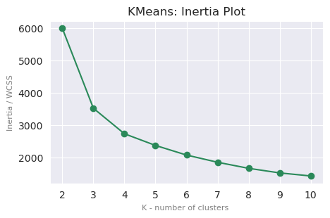

# Customer Segmentation For An Online Retail Store

*Customer Segmentation is a valuable tool for businesses, enabling them to align their strategies and tactics more effectively with current and potential customers. In today's marketing landscape, whether in B2B (business-to-business) or B2C (business-to-consumer) contexts, companies segment their customers based on various factors, including demographic, geographic, behavioral, psychographic, and technographic characteristics.The methodologies for customer segmentation are constantly evolving and may differ from one company to another. However, the primary goal of effective customer segmentation analysis is to gain a better understanding of customers' ever-changing needs and behaviors.*

*RFM (Recency, Frequency, Monetary) Analysis is a powerful method that enables marketing teams to create targeted campaigns for specific customer segments. These campaigns include offers, messages, and services that are relevant and tailored to customers’ buying patterns and behaviors.*

*An effective customer segmentation analysis leads to better customer insights, which enable marketing teams to make informed strategic decisions regarding messaging and positioning. This strategic approach fosters innovative and creative solutions that enhance profitability.* 

## 1. Data

This project utilizes machine learning for customer segmentation based on RFM analysis, focusing on three key features: Recency, Frequency, and Monetary value. The analysis aims to uncover valuable insights into customer purchasing behavior and transform the transactional data into a customer-centric dataset through feature engineering and clustering that will effectively aid in segmenting customers, enabling the business to determine appropriate marketing strategies and enhance the customer experience. Additionally, this analysis has the potential to significantly boost product sales, offering a promising outlook for the future.

Data Source: [UCI Machine Learning Repository | Online Retail II](https://archive.ics.uci.edu/dataset/502/online+retail+ii)

The dataset contains all transactions for a UK-based online retailer that sells all occasion gift-ware. This e-commerce dataset, made available by the UCI Machine Learning Repository, contains transactions made by customers from 2009 to 2011. This project will work on the latest transactions done in 2010 by approximately 4,300 customers.

Detailed description of the fields can be found in the aforementioned link.

## 2. Data Wrangling

The [Data Wrangling](../notebooks/DataWrangling.ipynb) step kicked off with 541,910 records in the 2010 tab of the dataset. There were inconsistencies found in the dataset such as blank customer ID (~25%), negative quantities (1.6%) which were found to be related to cancelled invoices, and duplicate records (~1% ). These records were dropped from the dataset as they were deemed not helpful in analyzing the customer transactions. 

An interesting column is the invoices which have values not conforming with the documented notation; however, thorough investigation suggested thatthose records don't contain irregularities in their respective numeric data. An assumption was made that these transactions were entered manually or done outside the order placement process. Because there are no anomalies in the numeric data, these records were retained in the analysis.

A total of 392733 records remain at the end of the Data Wrangling process.

|Number |Description                                      |
|-------|-------------------------------------------------|
|541910 |Initial number of records                        |
|-135080|Records with null Customer IDs dropped           |
|-8905  |Negative quantities or cancelled invoices dropped|
|-5192  |Duplicate records dropped                        |
|392733 |Rows after Data Wrangling process                |

## 3. EDA

The [EDA](./notebooks/ExploratoryDataAnalysis.ipynb) step revealed 0-priced items and transactions later than December 30, 2010. These records were then removed and the dataset ended up with 367,023 records after dropping those invalid records. Out of the 367,023 records the valid transactions for the whole year can be summarized as follows:

- Unique Invoices:  17132
- Unique Countries:  36
- Unique StockCodes:  3596
- Unique Customer IDs:  4219

Exploratory Data Analysis of the monthly sales indicated a steep decline in sales in December was revealed.

Further investigation revealed that the transactions for December was incomplete and that the latest was captured on the 9th of December which even less than the first half of the month. The total transactions in December only accounted for less than 5% of the whole transactions for the year. 
Although there was a transaction as high as 168,469.6, much of the sales during the month are in the lower amount. 

## 4. Pre-processing

[Preprocessing](./notebooks/Preprocessing.ipynb) step was initiated by feature engineering the columns to reflect the RFM features per customer - that is:

- Recency - How long has it been since the customer's last purchase date? * 
- Frequency - How many transactions in did the customer have? 
- Monetary - How much was spent by the customer?

The distribution of data per feature is right-skewed, which indicates presence of outliers.

The focus of this project is on clustering, so only the non-outliers were processed by the model. 
It is imperative to perform separate analysis on outliers as they represent extreme behaviours by the customers, such as very big spending and very frequent purchases. Below is the boxplot of the modeling data after outliers were separated:

The outliers were included in the cluster analysis after modeling:

- Monetary outliers:  402
- Frequency outliers:  412

## 5. Modeling

3 clustering algorithms have been considered for the analysis: 
- KMeans Clustering 
- Agglomerative Clustering 
- DBSCAN

**Hyperparameter Search: Nested Cross-Validation**

In the [Modeling](./notebooks/Modeling.ipynb) step, three hyperparameter optimization searches were tested accross all three aforementioned algorithms by utilizing the nested cross validation approach to determine the optimal parameters per algorithm.

As the hyperparameter search process cycles through each algorithm, a scoring function is used to determine the their respective silhouette scores. 

[Hyperparameter Search Results](./models/hp_tuning_results/hp_search.csv)

> Out of the model evaluation outcomes, the hyperparameters in **KMeans** and **Agglomerative Hierarchichal Clustering** algorithms produced better silhouette scores in both cross-validation searches than DBSCAN. 

> Given the results, DBSCAN may not be the appropriate clustering algorithm for this dataset since it has negative scores indicating a poor clustering performance (and more overlapping clusters) compared to the two other algorithms that have a higher score. 

> KMeans algorithm was better suited for clustering the data and thus was chosen for the Modeling process.

**KMeans metrics for CV and SMBO results**

Finding the best parameters for KMeans using GridSearchCV, RandomizedSearchCV, and SMBO using ***Hyperopt*** returned the following results: 

|Tuning            |Best_params                                                                                               |Inertia           |Silhouette_Score   |
|------------------|----------------------------------------------------------------------------------------------------------|------------------|-------------------|
|SMBO              |{'algorithm': 'lloyd', 'init': 'k-means++', 'max_iter': 319, 'n_clusters': 2, 'n_init': 9, 'tol': 0.1}    |5989.735240178855 |0.43220293648047825|
|RandomizedSearchCV|{'tol': 0.1, 'n_init': 5, 'n_clusters': 3, 'max_iter': 200, 'init': 'k-means++', 'algorithm': 'elkan'}    |3521.054583387378 |0.4529741764177548 |
|GridSeachCV       |{'algorithm': 'lloyd', 'init': 'k-means++', 'max_iter': 100, 'n_clusters': 3, 'n_init': 10, 'tol': 0.0001}|3517.1919694514713|0.4526652931153385 |

Using the preceding results, SMBO having the highest inertia doesn't necessarily imply that it has the best hyperparameters. Inertia scores decrease as n_cluster increases. The SMBO results with n_clusters = 2 (least loss determined by SMBO's fmin() ) had a unfair advantage over the results of the CVs. 

Likewise, the silhouette scores weren't used as the criteria because the results are from the same algorithm - it's only insightful when comparing between two different algorithms.  

So what's the criteria?

GridSearch and Randomized CV search methods are relatively inefficient compared to SMBO. In addition, Grid and random searches are completely uninformed by past evaluations and spends significant amount of time evaluating “bad” hyperparameters. 

**SMBO is generally deemed better** as it works by considering the previously seen hyperparameter combinations when choosing the next set of hyperparameters to evaluate; thus, its hyperparameters were used for the subsequent modeling. 

> **As SMBO is deemed the best hyperparameter search method, its corresponding hyperparameters were utilized in the model.** 

**Modeling with KMeans using the best hyperparameters from SMBO**

- Chosen algorithm : KMeans
- Best parameters : {'algorithm': 'lloyd', 'init': 'random', 'max_iter': 645, 'n_clusters': 2, 'n_init': 5, 'tol': 0.1}

The inertia plot was a very useful guide in getting a sense of the best K- no. of clusters.

The "knee" point is either in n_clusters=3 or n_clusters=4. The silhouette analysis provided insights on what would be the best between the two. 

The Silhouette Plot revealed that between n_clusters=3 and n_clusters=4, the former has lesser density in negative silhouette coefficient values, and each of the cluster label height is even better compared to the latter.

> **The optimal k number of clusters for this data using KMeans algorithm is 3.** 

[KMeans Evaluation Metrics Summary](./models/model_evaluation/km_metrics.csv) | [Pickle files for n_clusters: 2-10 ](./models)

## 6 Cluster Analysis

Meaningful labels were assigned simply by analyzing the distribution of the clusters in terms of the three key features - Recency, Frequency, and Monetary values. 

Starting with **Cluster-2**, its mean Recency feature is the highest compared to other clusters; however, both its mean Frequency and Monetary are the lowest compared to others, so this cluster represents the most recent buyers only. 

With **Cluster-1** having the highest mean in Monetary and Frequency feature, it's easily classified as the loyal customers. They are the customers that constantly or frequently buys items that are either in bulk or higher-value. Note, however, that the mean Recency feature is the lowest, indicative of no recent purchases. 

**Cluster-0** placed second in all of the features in terms of its mean values. They are not necessarily big spenders, frequent and recent buyers but the mean values in all three features are not the least.    

**Summary of the assigned labels to the 3 clusters:**
 
Cluster 0: ***Moderate***
- Moderately frequent buyers that are not necessarily high spenders, and haven't purchased recently. 

Cluster 1: ***Loyal***
- Frequent shoppers who are high spenders, although no recent purchases.

Cluster 2: ***Recent***
- Less frequent buyers who are low-spenders but made recent purchases.

**Analyzing the outliers in the data**

Outliers in the data were designated as follows:
- Monetary outliers : High-Spenders Customers
- Frequency outliers : Frequent Customers
- Both Monetary and Frequency outliers : VIPs 

### FINAL CUSTOMER SEGMENTATION

**Customer Segments Proportion**

**CUSTOMER SEGMENTS ANALYSIS AND RECOMMENDATIONS**

<b>MODERATE</b>
- Moderately frequent buyers that are not necessarily high spenders, and haven't purchased recently. 

Recommendation: 
1. Offer subscription on frequently bought items (whenever applicable)
2. Recommend "Frequently bought together" items
3. Implement customer retention and loyalty programs

<b>RECENT</b>
- Less frequent buyers who are low-spenders but made recent purchases.

Recommendations:
1. Identify recently purhcased products and run targeted "similar products" ad recommendations
2. Encourage to purchase more by offering incentives, vouchers, discounts, and bundle deals. 
3. Enhance customer experience and services

<b>LOYAL</b>
- Frequent shoppers who are high spenders, although no recent purchases.

Recommendations:
1. Re-engage by implementing rewards and loyalty programs, and exclusive perks
2. Run targeted ads for trending items and top items sold 
3. Offer subscription on frequently bought items (whenever applicable)

<b>VIPs</b>
- High value, frequent buyers. 

Recommendations:
1. Offer exclusive perks, and vouchers
2. Pamper and enhance shopping experience by offering expedited or free shipping (whenever applicable)
2. Offer additional discounts on bulk purchases (whenever applicable)

<b>FREQUENT</b>
- Very frequent buyers. 

Recommendations:
1. Offer subscription on frequently bought items (whenever applicable)
2. Implement customer retention and loyalty programs
3. Offer expedited or free shipping vouchers (whenever applicable)

